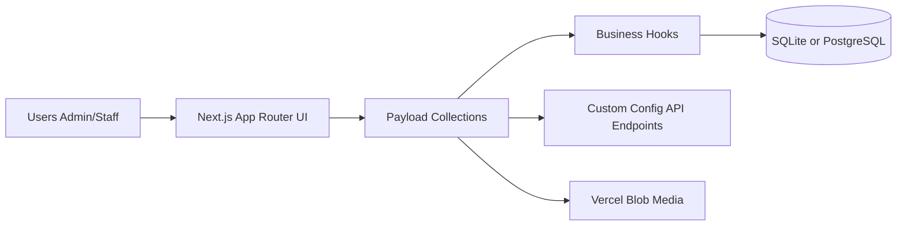

# Gym Management System
 
[](https://nextjs.org/)
[](https://payloadcms.com/)
[](https://www.typescriptlang.org/)
[](https://react.dev/)
[](https://tanstack.com/query/latest)
[](https://playwright.dev/)
[](LICENSE)
 
Aplicación fullstack orientada a negocios, diseñada para gestionar una operación de gimnasio de extremo a extremo: clientes, pagos, configuración y registros operacionales. Construida con una mentalidad backend-first, reglas de negocio explícitas y una arquitectura limpia lista para producción.
 
> 🚀 **[Demo](#)** · 📖 **[Read in English](README.es.md)**
 
---
 
## Preview
 
<table>
  <tr>
    <td align="center"><b>Dashboard</b></td>
    <td align="center"><b>Clients</b></td>
  </tr>
  <tr>
    <td></td>
    <td></td>
  </tr>
  <tr>
    <td align="center"><b>Payments</b></td>
    <td align="center"><b>Shift Schedule</b></td>
  </tr>
  <tr>
    <td></td>
    <td></td>
  </tr>
</table>

---
 
## Qué hace
 
Un sistema completo de gestión de gimnasios que cubre el ciclo operacional completo:

- **Gestión de clientes** — CRUD completo con historial de pagos por cliente.
- **Gestión de pagos** — Pagos mensuales con filtrado por mes/año y validación anti-duplicados (`client + month + year`).
- **Generación automática de pagos** — El pago inicial se crea automáticamente al registrar un nuevo cliente.
- **Horario de turnos** — Vista visual del horario basada en los pagos mensuales activos.
- **Configuración del negocio** — Configura precios y sube el logo de tu gimnasio.
- **Registros operacionales** — Auditoría organizada por entidad y tipo de acción.
 
---

## Arquitectura



## Decisiones técnicas clave
 
- **TypeScript de extremo a extremo** en backend y frontend, con tipos generados desde el esquema de Payload.
- **CMS headless como backend** — Payload CMS gestiona autenticación, colecciones y endpoints REST, eliminando código repetitivo sin perder control sobre la lógica de negocio.
- **Reglas de negocio explícitas** — La validación anti-duplicados y la generación automática de pagos se aplican a nivel de hooks de colección, no en la UI.
- **Arquitectura preparada para migración** — SQLite en local, PostgreSQL en producción. Cambiar entre ambos requiere solo una variable de entorno.
- **Buenas prácticas de ingeniería** — Tipos generados, tests de integración (Vitest), tests E2E (Playwright) y scripts de seed para entornos de demo reproducibles.
 
---

## Stack
 
| Cape | Tecnología |
|---|---|
| Framework | Next.js 15 + React 19 |
| CMS / Backend | Payload CMS 3 |
| Language | TypeScript 5.7 |
| Data fetching | TanStack Query v5 |
| Styling | Tailwind CSS + reusable UI components |
| Database (local) | SQLite |
| Database (production) | PostgreSQL (Neon) |
| Media storage | Vercel Blob |
| Testing | Vitest (integration) + Playwright (E2E) |
| Deployment target | Vercel |
 
---

## Configuración
 
```bash
pnpm install
cp .env.example .env
pnpm generate:types
pnpm dev
```

### Variables de entorno

| Variable | Descripción |
|---|---|
| `PAYLOAD_SECRET` | Clave secreta para la firma de sesiones de Payload CMS |
| `DATABASE_URL` | Ruta SQLite para desarrollo local (ej. `file:./gym.db`) |
| `POSTGRES_URL` | Cadena de conexión PostgreSQL para producción |
| `BLOB_READ_WRITE_TOKEN` | Token de Vercel Blob para subida de archivos |

> La app corre con SQLite por defecto. Configura POSTGRES_URL y cambia el adaptador de base de datos para el despliegue en producción.

### Scripts opcionales
 
```bash
pnpm seed:demo          # Populate with demo data
pnpm seed:demo:reset    # Reset and re-seed
pnpm test:int           # Run integration tests (Vitest)
pnpm test:e2e           # Run E2E tests (Playwright)
```

---
 
## Referencia de API
 
### Configuración

| Método | Endpoint | Descripción |
|---|---|---|
| `GET` | `/api/configuraciones/precios` | Obtener configuración de precios actual |
| `POST` | `/api/configuraciones/upsert` | Crear o actualizar configuración |
| `GET` | `/api/configuraciones/logo` | Obtener logo del gimnasio |
| `POST` | `/api/configuraciones/logo` | Subir logo del gimnasio |

> Los endpoints para clientes, pagos y registros son expuestos automáticamente por la REST API de Payload CMS en /api/[colección].
 
---
 
## Despliegue
 
Stack de producción: **Vercel + Neon (PostgreSQL) + Vercel Blob**.

1. Configura `POSTGRES_URL` y cambia el adaptador de base de datos en `payload.config.ts`.
2. Configura `BLOB_READ_WRITE_TOKEN` para la subida de archivos multimedia.
3. Despliega en Vercel — la app es totalmente compatible con entornos serverless.
 
---
 
## License
 
[MIT](LICENSE)
