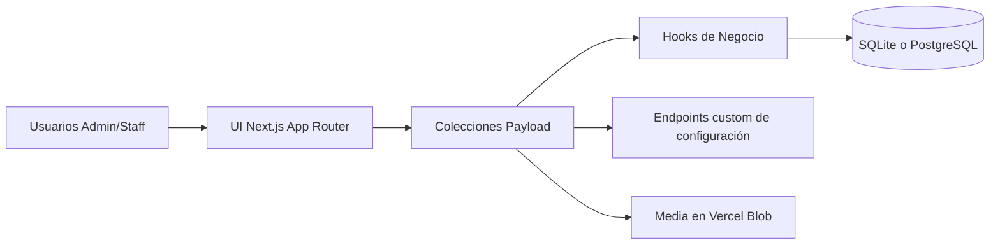

# Sistema de Gestión para Gimnasio

[](https://nextjs.org/)
[](https://payloadcms.com/)
[](https://www.typescriptlang.org/)
[](https://react.dev/)
[](https://tanstack.com/query/latest)
[](https://playwright.dev/)

Aplicación fullstack orientada a negocio para gestionar la operación diaria de un gimnasio: clientes, pagos, configuración y trazabilidad de acciones.

Construida con un enfoque backend-first, reglas de negocio explícitas y arquitectura preparada para producción.

## Resumen para Recruiters

Este proyecto demuestra:

- Modelado de dominio real con reglas de negocio no triviales.
- Implementación de CMS headless con autenticación y control por roles (`admin`, `staff`).
- Desarrollo end-to-end con TypeScript en backend y frontend.
- Arquitectura preparada para migración/evolución de sistemas legacy.
- Buenas prácticas de ingeniería: tipos generados, tests de integración, E2E y scripts de seed.

## Preview

<table align="center">
  <tr>
    <td align="center"><b>Dashboard</b></td>
    <td align="center"><b>Clientes</b></td>
    <td align="center"><b>Pagos</b></td>
  </tr>
  <tr>
    <td></td>
    <td></td>
    <td></td>
  </tr>
</table>

<table align="center">
  <tr>
    <td align="center"><b>Horario</b></td>
    <td align="center"><b>Configuración</b></td>
    <td align="center"><b>Logs</b></td>
  </tr>
  <tr>
    <td></td>
    <td></td>
    <td></td>
  </tr>
</table>

## Highlights

- CRUD completo de clientes con historial de pagos.
- CRUD completo de pagos mensuales con filtros por mes/año.
- Generación automática del pago inicial al crear cliente.
- Validación anti-duplicado (`cliente + mes + año`).
- Vista de horario por turnos basada en pagos activos del mes.
- Configuración de precios y logo del gimnasio.
- Logs operativos por entidad y acción.

## Setup Corto

```bash
pnpm install
cp .env.example .env
pnpm generate:types
pnpm dev
```

Scripts opcionales:

- `pnpm seed:demo`
- `pnpm seed:demo:reset`
- `pnpm test:int`
- `pnpm test:e2e`

## Stack Base

- Next.js 15 + React 19
- Payload CMS 3
- TypeScript
- TanStack Query
- Tailwind CSS + componentes reutilizables
- SQLite (default local) / compatible con PostgreSQL
- Vercel Blob para media
- Vitest + Playwright

## Arquitectura



## Notes

- Variables clave: `PAYLOAD_SECRET`, `DATABASE_URL`, `POSTGRES_URL`, `BLOB_READ_WRITE_TOKEN`.
- La app corre localmente con SQLite por defecto.
- Objetivo de despliegue a producción: **Vercel + Neon + Vercel Blob**.
- Se requiere internet para usar servicios gestionados externos.

## Demo

- URL pública: [PENDIENTE]
- Credenciales demo:
  - Admin: [PENDIENTE]
  - Staff: [PENDIENTE]

## Endpoints de Configuración

- `GET /api/configuraciones/precios`
- `POST /api/configuraciones/upsert`
- `GET /api/configuraciones/logo`
- `POST /api/configuraciones/logo`

## English Version

Read in English: `README.md`
