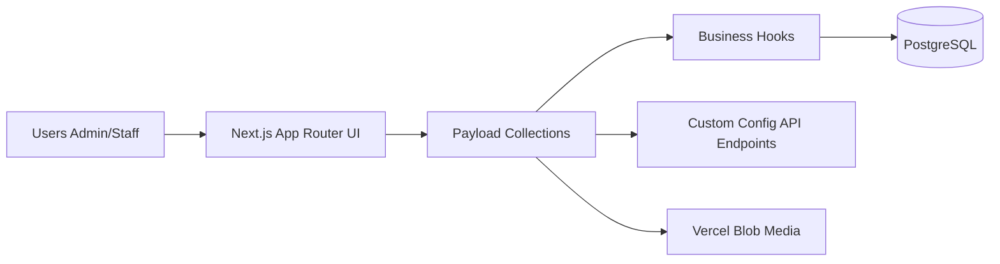

# Gym Management System

[](https://nextjs.org/)
[](https://payloadcms.com/)
[](https://www.typescriptlang.org/)
[](https://react.dev/)
[](https://tanstack.com/query/latest)
[](https://playwright.dev/)
[](LICENSE)

Aplicación fullstack orientada a negocios, diseñada para gestionar una operación de gimnasio de extremo a extremo: clientes, pagos, configuración y registros operacionales. Construida con una mentalidad backend-first, reglas de negocio explícitas y una arquitectura limpia lista para producción.

> 🚀 **[Demo](https://liftdesk-demo.vercel.app)** · 📖 **[Read in English](README.es.md)**

## Acceso a la demo

Hay dos roles disponibles para explorar la app:

| Rol     | Email                  | Contraseña | Acceso                                              |
| ------- | ---------------------- | ---------- | --------------------------------------------------- |
| `admin` | `admin@demo.gym.local` | `admin123` | Panel admin de Payload CMS + frontend personalizado |
| `staff` | `staff@demo.gym.local` | `staff123` | Solo frontend personalizado                         |

> La base de datos de la demo tiene 100 registros de prueba. Los datos pueden resetearse periódicamente.

---

## Preview

<table>
  <tr>
    <td align="center"><b>Dashboard</b></td>
    <td align="center"><b>Clients</b></td>
  </tr>
  <tr>
    <td></td>
    <td></td>
  </tr>
  <tr>
    <td align="center"><b>Payments</b></td>
    <td align="center"><b>Shift Schedule</b></td>
  </tr>
  <tr>
    <td></td>
    <td></td>
  </tr>
</table>

---

## Qué hace

Un sistema completo de gestión de gimnasios que cubre el ciclo operacional completo:

- **Gestión de clientes** — CRUD completo con historial de pagos por cliente.
- **Gestión de pagos** — Pagos mensuales con filtrado por mes/año y validación anti-duplicados (`client + month + year`).
- **Generación automática de pagos** — El pago inicial se crea automáticamente al registrar un nuevo cliente.
- **Horario de turnos** — Vista visual del horario basada en los pagos mensuales activos.
- **Configuración del negocio** — Configura precios y sube el logo de tu gimnasio.
- **Registros operacionales** — Auditoría organizada por entidad y tipo de acción.

---

## Arquitectura



## Decisiones técnicas clave

- **TypeScript de extremo a extremo** en backend y frontend, con tipos generados desde el esquema de Payload.
- **CMS headless como backend** — Payload CMS gestiona autenticación, colecciones y endpoints REST, eliminando código repetitivo sin perder control sobre la lógica de negocio.
- **Reglas de negocio explícitas** — La validación anti-duplicados y la generación automática de pagos se aplican a nivel de hooks de colección, no en la UI.
- **Arquitectura exclusiva con PostgreSQL** — SQLite fue eliminado intencionalmente para garantizar compatibilidad total con entornos serverless (Vercel). Se requiere una instancia local de PostgreSQL o una base de datos gratuita en Neon incluso para desarrollo.
- **Buenas prácticas de ingeniería** — Tipos generados, tests de integración (Vitest), tests E2E (Playwright) y scripts de seed para entornos de demo reproducibles.
- **Control de acceso basado en roles (RBAC)** — Dos roles (`admin`, `staff`) con permisos diferenciados: los administradores acceden tanto al panel de Payload CMS como al frontend personalizado, mientras que el rol staff está restringido al frontend. Las rutas protegidas aplican esto a nivel de middleware y hooks de colección.

---

## Stack

| Cape              | Tecnología                              |
| ----------------- | --------------------------------------- |
| Framework         | Next.js 15 + React 19                   |
| CMS / Backend     | Payload CMS 3                           |
| Language          | TypeScript 5.7                          |
| Data fetching     | TanStack Query v5                       |
| Styling           | Tailwind CSS + reusable UI components   |
| Database          | PostgreSQL (Neon recommended)           |
| Media storage     | Vercel Blob                             |
| Testing           | Vitest (integration) + Playwright (E2E) |
| Deployment target | Vercel                                  |

---

## Configuración

```bash
pnpm install
cp .env.example .env
pnpm generate:types
pnpm dev
```

### Variables de entorno

| Variable                | Descripción                                                                                                           |
| ----------------------- | --------------------------------------------------------------------------------------------------------------------- |
| `PAYLOAD_SECRET`        | Clave secreta para la firma de sesiones de Payload CMS                                                                |
| `POSTGRES_URL`          | Cadena de conexión PostgreSQL (principal). Usa `DATABASE_URL` como alternativa si no está definida                    |
| `DATABASE_URL`          | Cadena de conexión alternativa (opcional)                                                                             |
| `BLOB_READ_WRITE_TOKEN` | Token de Vercel Blob para subida de archivos (opcional — deshabilita el almacenamiento de medios si no está definido) |

> La app requiere una base de datos PostgreSQL. Para desarrollo local puedes usar una instancia local de PostgreSQL o una base de datos gratuita en Neon. SQLite **no está soportado** — el adaptador fue eliminado para garantizar compatibilidad con entornos serverless como Vercel.

### Scripts opcionales

```bash
pnpm seed:demo          # Populate with demo data
pnpm seed:demo:reset    # Reset and re-seed
pnpm test:int           # Run integration tests (Vitest)
pnpm test:e2e           # Run E2E tests (Playwright)
```

---

## Referencia de API

### Configuración

| Método | Endpoint                       | Descripción                             |
| ------ | ------------------------------ | --------------------------------------- |
| `GET`  | `/api/configuraciones/precios` | Obtener configuración de precios actual |
| `POST` | `/api/configuraciones/upsert`  | Crear o actualizar configuración        |
| `GET`  | `/api/configuraciones/logo`    | Obtener logo del gimnasio               |
| `POST` | `/api/configuraciones/logo`    | Subir logo del gimnasio                 |

> Los endpoints para clientes, pagos y registros son expuestos automáticamente por la REST API de Payload CMS en /api/[colección].

---

## Despliegue

Stack de producción: **Vercel + Neon (PostgreSQL) + Vercel Blob**.

1. Crea una base de datos PostgreSQL en [Neon](https://neon.tech) o cualquier proveedor compatible.
2. Configura `POSTGRES_URL` en las variables de entorno de Vercel.
3. Configura `BLOB_READ_WRITE_TOKEN` para la subida de archivos (opcional — el almacenamiento de medios se deshabilita si el token no está presente).
4. Despliega en Vercel — la app es totalmente compatible con entornos serverless.

> Para desarrollo local, apunta `POSTGRES_URL` a una instancia local de PostgreSQL o a una rama de desarrollo en Neon.

---

## License

[MIT](LICENSE)
