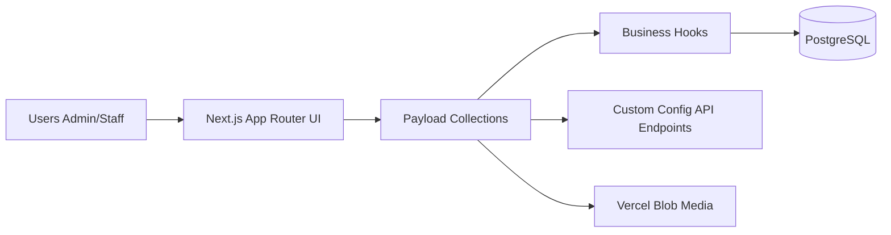

# Gym Management System
 
[](https://nextjs.org/)
[](https://payloadcms.com/)
[](https://www.typescriptlang.org/)
[](https://react.dev/)
[](https://tanstack.com/query/latest)
[](https://playwright.dev/)
[](LICENSE)
 
Business-oriented fullstack app designed to run a gym operation end-to-end: clients, payments, settings, and operational logs. Built with a backend-first mindset, explicit business rules, and a clean architecture ready for production.
 
> 🚀 **[Live Demo](#)** · 📖 **[Versión en Español](README.es.md)**
 
---
 
## Preview
 
<table>
  <tr>
    <td align="center"><b>Dashboard</b></td>
    <td align="center"><b>Clients</b></td>
  </tr>
  <tr>
    <td></td>
    <td></td>
  </tr>
  <tr>
    <td align="center"><b>Payments</b></td>
    <td align="center"><b>Shift Schedule</b></td>
  </tr>
  <tr>
    <td></td>
    <td></td>
  </tr>
</table>

---
 
## What it does
 
A complete gym management system covering the full operational loop:
 
- **Client management** — Full CRUD with payment history per client.
- **Payment management** — Monthly payments with month/year filtering and anti-duplicate validation (`client + month + year`).
- **Automatic payment generation** — Initial payment is created automatically when a new client is registered.
- **Shift schedule** — Visual schedule view powered by active monthly payments.
- **Business settings** — Configure pricing and upload your gym's brand logo.
- **Operational logs** — Audit trail organized by entity and action type.
 
---

## Architecture



## Key Engineering Decisions
 
- **End-to-end TypeScript** across backend and frontend with generated types from Payload's schema.
- **Headless CMS as backend** — Payload CMS handles auth, collections, and REST endpoints, removing boilerplate while keeping full control over business logic.
- **Explicit business rules** — Anti-duplicate payment validation and automatic payment generation are enforced at the collection hook level, not in the UI.
- **PostgreSQL-only architecture** — SQLite was intentionally removed to ensure full compatibility with serverless environments (Vercel). A local PostgreSQL instance or a free Neon database is required even for development.
- **Engineering quality practices** — Generated types, integration tests (Vitest), E2E tests (Playwright), and seed scripts for reproducible demo environments.
 
---

## Stack
 
| Layer | Technology |
|---|---|
| Framework | Next.js 15 + React 19 |
| CMS / Backend | Payload CMS 3 |
| Language | TypeScript 5.7 |
| Data fetching | TanStack Query v5 |
| Styling | Tailwind CSS + reusable UI components |
| Database | PostgreSQL (Neon recommended) |
| Media storage | Vercel Blob |
| Testing | Vitest (integration) + Playwright (E2E) |
| Deployment target | Vercel |
 
---

## Quick Setup
 
```bash
pnpm install
cp .env.example .env
pnpm generate:types
pnpm dev
```

### Environment Variables
 
| Variable | Description |
|---|---|
| `PAYLOAD_SECRET` | Secret key for Payload CMS session signing |
| `POSTGRES_URL` | PostgreSQL connection string (primary). Falls back to `DATABASE_URL` if not set |
| `DATABASE_URL` | Alternative PostgreSQL connection string (optional fallback) |
| `BLOB_READ_WRITE_TOKEN` | Vercel Blob token for media uploads (optional — disables media storage if not set) |
 
> The app requires a PostgreSQL database. For local development, you can use a local PostgreSQL instance or a free Neon database. SQLite is **not supported** — the adapter was removed to ensure compatibility with serverless environments like Vercel.

### Optional Scripts
 
```bash
pnpm seed:demo          # Populate with demo data
pnpm seed:demo:reset    # Reset and re-seed
pnpm test:int           # Run integration tests (Vitest)
pnpm test:e2e           # Run E2E tests (Playwright)
```

---
 
## API Reference
 
### Settings
 
| Method | Endpoint | Description |
|---|---|---|
| `GET` | `/api/configuraciones/precios` | Get current pricing configuration |
| `POST` | `/api/configuraciones/upsert` | Create or update settings |
| `GET` | `/api/configuraciones/logo` | Get gym logo |
| `POST` | `/api/configuraciones/logo` | Upload gym logo |
 
> Additional endpoints for clients, payments, and logs are exposed automatically by Payload CMS's REST API at `/api/[collection]`.
 
---
 
## Deployment

Production stack: **Vercel + Neon (PostgreSQL) + Vercel Blob**.

1. Create a PostgreSQL database on [Neon](https://neon.tech) or any PostgreSQL provider.
2. Set `POSTGRES_URL` in your Vercel environment variables.
3. Configure `BLOB_READ_WRITE_TOKEN` for media uploads (optional — media storage is disabled if the token is absent).
4. Deploy to Vercel — the app is fully compatible with serverless environments.

> For local development, point `POSTGRES_URL` to a local PostgreSQL instance or a Neon development branch.
 
---
 
## License
 
[MIT](LICENSE)
